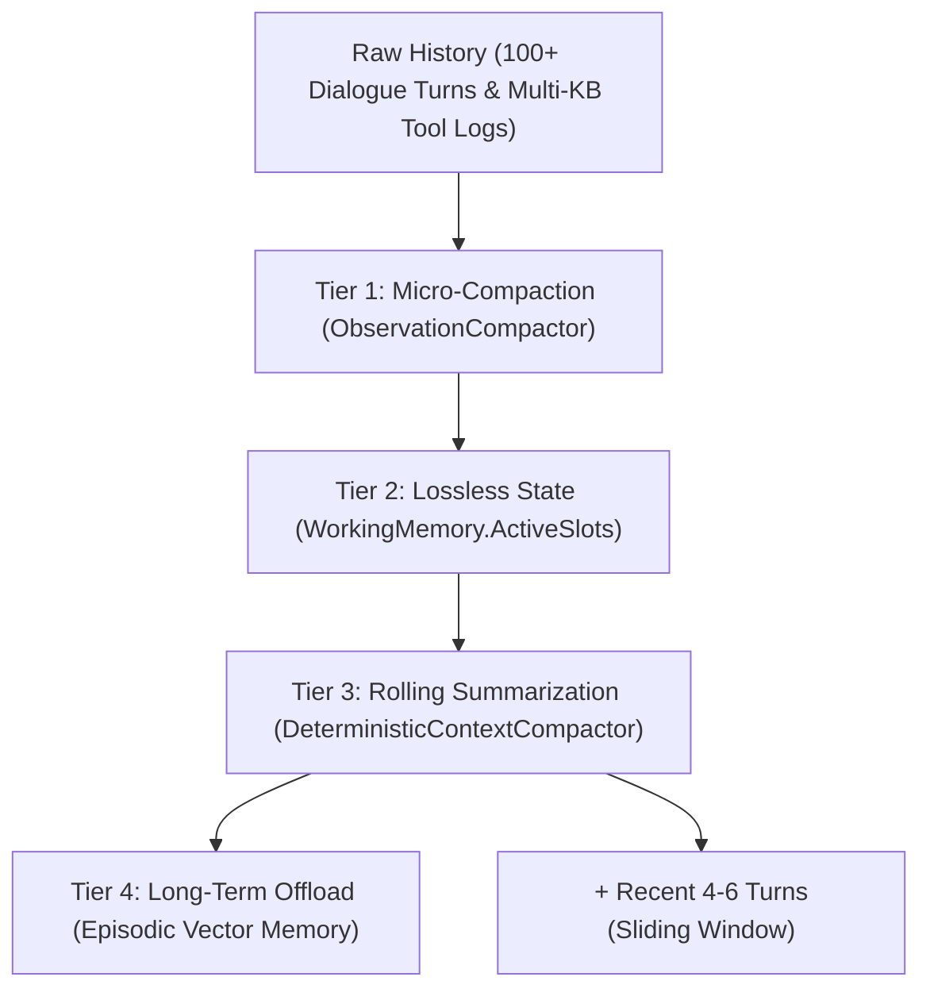
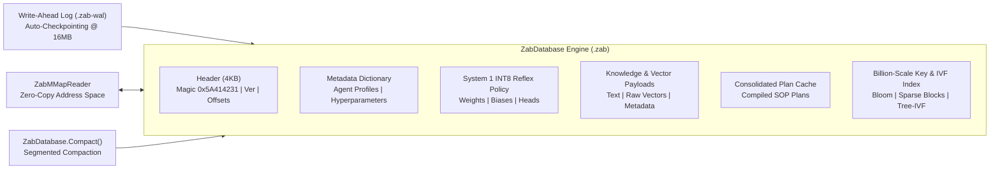
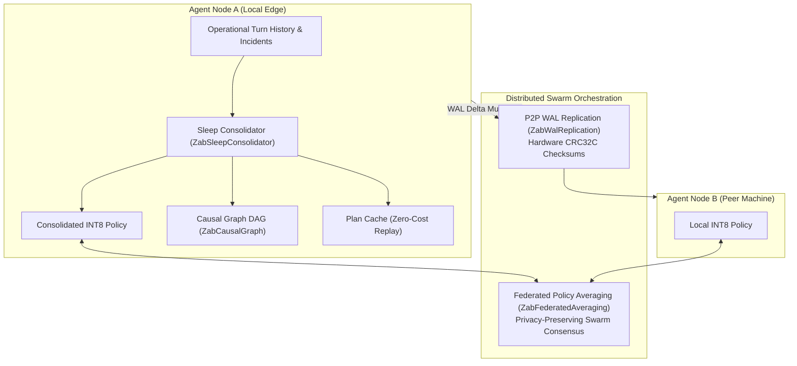

# 🤖 ZeroAgent: Sovereign Pure C# Cognitive Agent & Multi-Agent Swarm Framework

[](https://github.com/kzxl/ZeroAgent)
[](LICENSE)
[](https://dotnet.microsoft.com/)
[-brightgreen.svg)]()
[-success.svg)]()
[-orange.svg)]()
[-brightgreen.svg)]()

**ZeroAgent** is an enterprise-grade, deterministic AI Agent and Multi-Agent Swarm framework engineered in **100% pure C#** for the .NET ecosystem. Operating in **Tier 5 (Presentation & Orchestration)** of the [ZeroPlatform](https://github.com/kzxl/ZeroPlatform) ecosystem, ZeroAgent provides autonomous ReAct execution loops, zero-reflection tool calling protocols, dual-process System 1 (INT8 fast reflex) & System 2 (deliberative ReAct) cognitive architecture, sovereign embedded database storage (`ZabDatabase` .zab), billion-scale indexing, sleep consolidation cycles, and federated multi-agent swarm coordination—completely independent of external Python runtimes or cloud-locked SDKs.

---

## 🏛️ The 5 Pillars of ZeroAgent Architecture

ZeroAgent is engineered around 5 foundational architectural pillars designed for high throughput, sub-millisecond predictability, and verifiable safety:

```
                      ┌───────────────────────────────────────────────┐
                      │              ZeroAgent Core Engine            │
                      └──────────────────────┬────────────────────────┘
                                             │
             ┌───────────────────────────────┼───────────────────────────────┐
             │                               │                               │
             ▼                               ▼                               ▼
    ┌─────────────────┐             ┌─────────────────┐             ┌─────────────────┐
    │    Pillar 1:    │             │    Pillar 2:    │             │    Pillar 3:    │
    │ Zero-Reflection │             │ Two-Tier Bridge │             │ KV-Cache Layout │
    │  Tool Protocol  │             │ Reflex <-> ReAct│             │ Prefix Stability│
    └─────────────────┘             └─────────────────┘             └─────────────────┘
             │                               │
             ▼                               ▼
    ┌─────────────────┐             ┌─────────────────┐
    │    Pillar 4:    │             │    Pillar 5:    │
    │ Knapsack Budget │             │ Fluent Builder  │
    │ Context Packer  │             │ Type-Safe DSL   │
    └─────────────────┘             └─────────────────┘
```

### 1. Zero-Reflection Tool Protocol (`IAgentTool`)
- High-performance tool registration through strongly-typed delegates and explicit schema contracts (`JsonSchemaConstraint`).
- Zero reflection overhead during invocation, enabling sub-microsecond tool dispatch.
- Native Human-in-the-Loop (`HitlSafetyGate`) gating for destructive, safety-critical, or high-privilege actions with cryptographic audit logging.

### 2. Dual-Process Cognitive Escalation Bridge (`CognitiveEscalationBridge` & `ZabNeuralPolicy`)
- **System 1 (Sub-0.1ms INT8 Reflex Fast Path)**: Pure C# vectorized INT8 neural policy and Dialogue State Tracking (DST). Executes compiled reflex policies, multi-head cognitive routing (Domain, Risk, Complexity, Strategy, Confidence), and routine operations with **0 GPU/LLM overhead**.
- **System 2 (Deliberative Symbolic & ReAct Engine)**: Activated automatically when analytical reasoning is demanded (*"tại sao"*, *"phân tích"*, *"đối chiếu"*), risk score exceeds threshold ($> 0.60$), or reflex confidence is insufficient ($< 0.70$). Executes autonomous multi-step ReAct reasoning, tool observation cycles, and self-correction.

### 3. KV-Cache Friendly Prompt Layout (`PromptLayout`)
- Structurally partitions prompt templates into **Static Prefix** (System Role, Safety Directives, Tool Schemas) and **Dynamic Suffix** (Working Memory, Slots, Contextual turns).
- Guarantees maximum prefix KV-cache reuse on local inference engines (`ZeroInference` / vLLM / llama.cpp), cutting TTFT (Time-To-First-Token) by up to 70%.

### 4. Knapsack Context Budget & Compaction Engine (`ContextBudgetManager` & `IContextCompactor`)
- Algorithmic token budgeting applying greedy/knapsack optimization to pack message histories, dynamic tool schemas, and episodic recollections into strict context windows.
- Lossless context distillation via `DeterministicContextCompactor`: transforms evicted historical turns into high-density `<CONTEXT_SUMMARY>` blocks, completely preventing context degradation ("Lost in the Middle") and escalation blindness.
- Observation masking via `ObservationCompactor`: compresses multi-kilobyte tool outputs down to compact semantic signatures inside ReAct execution trajectories.

### 5. Fluent Builder DSL (`ZeroAgentBuilder`)
- Unified, type-safe builder interface to declaratively compose Memory Engines, Cognitive Escalation Bridges, Safety Gates, Tools, and Model Backends.

---

## 🧠 4-Tier Agentic Memory System

ZeroAgent features a multi-tiered cognitive memory hierarchy that mimics human operational cognition:

```
┌────────────────────────────────────────────────────────────────────────┐
│                        4-Tier Agentic Memory                           │
├───────────────────┬────────────────────────────────────────────────────┤
│ Tier              │ Description & Scope                                │
├───────────────────┼────────────────────────────────────────────────────┤
│ Working Memory    │ Active conversation turns, slot tracking, and      │
│                   │ deterministic Anaphora / Coreference Resolution    │
│                   │ (resolves "nó", "máy này" -> active equipment ID). │
├───────────────────┼────────────────────────────────────────────────────┤
│ Semantic Memory   │ SOPs, operational manuals, and domain guidelines   │
│                   │ vector-indexed via ZeroVector for instant recall.  │
├───────────────────┼────────────────────────────────────────────────────┤
│ Episodic Memory   │ Historical incidents, past failures, and verified  │
│                   │ resolutions stored as semantic episodes.           │
├───────────────────┼────────────────────────────────────────────────────┤
│ Response Cache    │ High-confidence (similarity >= 0.95) vector cache  │
│                   │ for idempotent queries, bypassing NLU/LLM cycles.  │
└───────────────────┴────────────────────────────────────────────────────┘
```

---

## 🗜️ 4-Tier Context Compaction & Rolling Summarization

To support multi-turn sessions (50–100+ turns) without context rotting, token overflow, or latency spikes, ZeroAgent incorporates a 4-tier context compaction hierarchy:



1. **Tier 1: Observation Masking (`ObservationCompactor`)**:
   - Truncates voluminous tool outputs (such as TSDB queries or SQL dumps) into compact head/tail signatures while retaining essential metrics, reducing trajectory token consumption by 70–85%.
2. **Tier 2: Structured Working Memory Retention**:
   - Critical entities (`machine_id`, `metric`, `area`, `tableName`) are tracked in typed slot dictionaries outside of the message array and are never lost during text truncation.
3. **Tier 3: Pure C# Rolling Summarization (`DeterministicContextCompactor`)**:
   - Executes in **< 0.05 ms** without requiring external LLM calls.
   - When turns exceed `MaxRetainedTurns` or when `PruneToTokenBudget` is triggered, older turns are distilled into a high-density `<CONTEXT_SUMMARY>` block preserving verified decisions and chronological milestones.
   - Injected into `CognitiveEscalationBridge` so that deliberative ReAct agents have 100% historical context awareness.
4. **Tier 4: Episodic Vector Offloading**:
   - Deep diagnostic episodes and solutions are permanently indexed in `AgenticMemoryEngine.EpisodicMemory` for on-demand associative recall.

---

## 🗄️ Sovereign Database Engine: ZabDatabase (`.zab`)

`ZabDatabase` is a high-performance, single-file, zero-dependency embedded database engineered specifically for autonomous agent memory, neural policy storage, knowledge retrieval, and trajectory replay:



### Key Architectural Capabilities:
- **Zero-Dependency Binary Format**: Single `.zab` file containing header, metadata dictionary, INT8 policy weights, knowledge vector payloads, plan cache, and index blocks.
- **Zero-Copy Memory-Mapped I/O (`ZabMMapReader`)**: Memory-maps binary sections directly into process virtual memory, eliminating buffer copies and heap allocations.
- **Write-Ahead Logging (`ZabWalJournal`)**: Append-only transaction log ensuring full ACID durability with hardware-accelerated CRC32C checksums and automatic size-triggered checkpoints (16MB threshold).
- **Segmented Storage Manager (`ZabSegmentedStorageManager`)**: Partitions massive databases into 2GB segments for incremental rolling compaction and safe multi-terabyte expansion.

---

## ⚡ Dual-Process Cognitive Architecture & Level 2 Multi-Head Routing

ZeroAgent mirrors the human dual-process cognitive paradigm (Kahneman System 1 / System 2):

```
                                  User Utterance / Telemetry Event
                                                 │
                                                 ▼
                             ┌───────────────────────────────────────┐
                             │    Feature Vectorizer (Float / INT8)  │
                             └───────────────────┬───────────────────┘
                                                 │
                                                 ▼
                             ┌───────────────────────────────────────┐
                             │       System 1 INT8 Neural Policy     │
                             │        (Vectorized Fast Reflex)       │
                             └───────────────────┬───────────────────┘
                                                 │
                  ┌──────────────────────────────┴──────────────────────────────┐
                  │ Level 2 Multi-Head Cognitive Routing                        │
                  ├──────────────────────────────┬──────────────────────────────┤
                  │ 1. Domain Head               │ 2. Risk Head                 │
                  │ 3. Complexity Head           │ 4. Strategy Head             │
                  │ 5. Confidence Score (0.0-1.0)│                              │
                  └──────────────────────────────┬──────────────────────────────┘
                                                 │
                                 ┌───────────────┴───────────────┐
                                 │ Decision: Escalate to System 2?│
                                 └───────┬───────────────┬───────┘
                                         │               │
                        Confidence >= 0.70 & Risk <= 0.60 │ Confidence < 0.70 OR Risk > 0.60
                                         │               │
                                         ▼               ▼
                        ┌────────────────────────┐  ┌────────────────────────┐
                        │ System 1 Fast Reflex   │  │ System 2 ReAct Engine  │
                        │ Direct Tool / Slot     │  │ Deliberative Reasoning │
                        │ Latency: < 0.1 ms      │  │ Tool Exploration Loops │
                        │ GPU / LLM Cost: 0      │  │ Dynamic Plan Synthesis │
                        └────────────────────────┘  └────────────────────────┘
```

### Multi-Head Cognitive Heads:
1. **Domain Head**: Classifies query into operational contexts (SCADA, ERP, Diagnostics, Safety, General).
2. **Risk Head**: Estimates blast radius ($0.0 - 1.0$) for safety gating.
3. **Complexity Head**: Predicts required reasoning depth (Linear Slot Fill vs Multi-Step Analysis).
4. **Strategy Head**: Selects direct reflex execution, cache retrieval, or tool invocation.
5. **Confidence Head**: Vectorized softmax score governing autonomous escalation.

---

## 🌐 Billion-Scale Key Indexing & Sub-Linear Vector Search

To seamlessly handle up to **1,000,000,000 records** ($10^9$) on local edge servers or industrial gateways without memory exhaustion:

```
┌────────────────────────────────────────────────────────────────────────┐
│               Billion-Scale Multi-Tier Index Architecture              │
├───────────────────────┬──────────────────────┬─────────────────────────┤
│ Layer                 │ Structure / Algorithm│ Performance Metric      │
├───────────────────────┼──────────────────────┼─────────────────────────┤
│ Negative Guard        │ Bit-Vector Bloom     │ 10ns lookup rejection;  │
│                       │ Filter (Murmur3)     │ 99% disk I/O eliminated │
├───────────────────────┼──────────────────────┼─────────────────────────┤
│ Sparse Block Index    │ 2-Level Sparse Index │ < 3µs point lookup;     │
│                       │ (Block Size: 4,096)  │ O(log(Blocks)) ~ 22 ops │
├───────────────────────┼──────────────────────┼─────────────────────────┤
│ Sub-Linear Vector IVF │ 2-Tier Tree-IVF      │ < 400 distance ops;     │
│                       │ (Hierarchical Voronoi│ 80x faster than flat    │
│                       │  Meta-Centroids)     │ scan at 10^9 vectors    │
└───────────────────────┴──────────────────────┴─────────────────────────┘
```

- **Bit-Vector Bloom Filter (`ZabBloomFilter`)**: Compact in-memory filter that guarantees zero false negatives. Rejects nonexistent keys in ~10ns, bypassing SSD lookups entirely.
- **2-Level Sparse Block Index (`ZabBillionScaleIndex`)**: Maintains sparse anchor keys for contiguous data blocks. Point-lookup takes $O(\log(\text{Blocks}))$ comparisons ($\le 22$ binary search steps for $10^9$ keys), consuming $< 3\ \mu\text{s}$ with zero GC allocations.
- **2-Tier Hierarchical IVF (`ZabIvfVectorIndex`)**: Organizes vector space into $M = \sqrt{K} \approx 178$ Meta-Centroids and $K = \sqrt{N} \approx 31{,}622$ Sub-Centroids. Prunes $98.7\%$ of Voronoi partitions before calculating exact vector distances.

---

## 🔄 Cognitive Evolution & Distributed Multi-Agent Swarm



- **Sleep Consolidation Cycle (`ZabSleepConsolidator`)**: Automatically consolidates episodic memory traces during idle periods. Updates System 1 INT8 neural weights, builds high-reward plan caches, and applies Ebbinghaus logarithmic forgetting decay.
- **Causal Reasoning Graph (`ZabCausalGraph`)**: Directed Acyclic Graph tracking causal tuples $(\text{Condition} \to \text{Action} \to \text{Outcome} \to \text{Reward})$ to infer optimal remediation actions without trial-and-error.
- **Mixture of Reflex Experts (`ZabMixtureOfReflexes`)**: Specialized sub-policies (Telemetric, Financial, Safety, Diagnostic) coordinated via dynamic gating and cache affinity.
- **P2P WAL Replication (`ZabWalReplication`)**: Streamline incremental database mutations between swarm nodes with CRC32C hardware validation and out-of-order sequence rejection.
- **Federated Policy Averaging (`ZabFederatedAveraging`)**: Aggregates INT8 neural weights across hundreds of distributed agents without exposing raw operational data or user payloads.

---

## 🛡️ 5-Risk Production Hardening & Reliability Guarantees

| Production Risk | Physical/Architectural Bottleneck at $10^9$ | Hardened Pure C# Mitigation |
| :--- | :--- | :--- |
| **1. 64-bit Hash Collision** | Birthday paradox: $\sim 1.35\%$ collision probability at $10^9$ keys. | **Candidate Offsets + Exact String Verification**: Sparse block index filters candidate file offsets; `ZabMMapReader` verifies exact string match against disk payload. Zero false positives. |
| **2. Storage Exhaustion** | Compacting multi-GB/TB databases using temporary files can exhaust disk headroom ($2\times$ space). | **Disk Headroom Pre-Check & Segmented DB**: Enforces `DriveInfo.AvailableFreeSpace >= 1.5x` before compaction; segmented chunks ($2\text{GB}$) compacted independently. |
| **3. 32-bit Virtual Memory Overflow** | 32-bit (x86) processes are limited to 2GB address space; mapping large files crashes with `OutOfMemoryException`. | **Adaptive Paged Windowing**: Detects `!Environment.Is64BitProcess` and streams 64KB localized window views on-demand instead of mapping the entire file. |
| **4. IVF Centroid Bottleneck** | Scanning $K \approx 31{,}622$ centroids sequentially at billion-scale saturates CPU cache. | **2-Tier Tree-IVF Hierarchical Pruning**: Meta-centroids cluster Voronoi cells, reducing distance computations from $31{,}622$ to $< 400$ ($80\times$ faster). |
| **5. Catastrophic Forgetting** | Continuous online reinforcement degrades base capabilities of System 1 reflex policy. | **Elastic Weight Consolidation (EWC)**: Anchor weights preservation (`AnchorWeights`), drift clamping (`MaxDriftFromAnchor`), and elastic decay ($\lambda = 0.999$) protect foundational skills. |

---

## 👤 Long-Term User Persona & Behavioral Personalization Memory (`UserPersona`)

Similar to ChatGPT's custom instructions and context memory, ZeroAgent tracks long-term user characteristics across sessions:

- **Linguistic Pronoun Detection**: Dynamically recognizes communication pronouns ("anh - em", "tao - mày", "tôi - bạn") from user utterances and automatically personalizes response salutations (`Dạ anh...`, `...nhé!`).
- **Domain & Topic Affinity**: Tracks interaction frequencies per intent (`DominantDomain`), enabling rapid disambiguation of ambiguous questions (e.g. defaulting to Sales Orders for Sales Managers without repetitive confirmation).
- **Transactional Safety (No Entity Guessing)**: Avoids arbitrarily pre-filling or assuming specific entities (customers, order codes); users must explicitly provide or confirm entity identifiers to guarantee enterprise transactional integrity.

---

## 🚪 Anonymous Guest Chat & In-Flight Session Upgrade (`UserRole.Guest`)

ZeroAgent natively supports unauthenticated public guest interactions alongside enterprise users:

- **Auto-Detection & Session Isolation**: Session IDs prefixed with `guest_` or `anon_` are automatically resolved to `UserRole.Guest`. Each guest operates with strictly isolated ephemeral memory, preventing cross-guest persona contamination.
- **Public Inquiries Without Login**: Guests can freely access public FAQs, company information, and SOP manuals indexed in `SemanticMemory`.
- **Role-Based Action Gates**: Protected operational intents (machine control, live PLC actuation, sensitive ERP financial/sales queries) are blocked by RBAC gates with a polite, non-punitive authentication prompt (`FormatGuestLoginRequired`).
- **In-Flight Session Upgrade (`UpgradeGuestSession`)**: When a guest logs in midway through a conversation, their collected slots, multi-turn history, and intent state are seamlessly migrated to the authenticated `UserProfile`, allowing immediate execution without re-asking questions.

---

## ⚖️ Memory vs Intent Dynamic Conflict Arbitration Matrix

To eliminate collisions between vector memory search (Semantic / Episodic) and transactional intents:

| Layer / Mechanism | Conflict / Duplication Mode | Dynamic Arbitration Resolution |
|---|---|---|
| **Working Memory Guard** | User answering a slot matches keywords in a document | During `SessionState.CollectingSlots`, slot accumulation strictly takes precedence over memory queries, preventing dialogue loops. |
| **Substring Intent Ambiguity** | Query contains "quá nhiệt" in "Quy trình xử lý quá nhiệt F-01" | Explicit inquiry modifiers (`quy trình`, `hướng dẫn`, `sự cố`, `lịch sử`) route directly to Knowledge / Episodic retrieval rather than misfiring live telemetry (`CHECK_TEMPERATURE`). |
| **Conversational Interruption** | User digresses with an SOP question while filling slots | Knowledge query is resolved immediately (`SessionState.Idle`), while preserving the pending slot in Working Memory for subsequent turns. |
| **High-Confidence Intent Supremacy** | Generic document keyword overlaps with dedicated intent | Specialized operational intents with high confidence ($\ge 0.65$) take precedence over loose keyword document matches. |

---

## 🛡️ Enterprise Resilience, Bi-Temporal Memory & Security Hardening

To support multi-node industrial deployments and guarantee zero downtime / data corruption:

- **State Checkpointing (`IDialogSessionStore`)**: Abstracted session persistence supporting `InMemoryDialogSessionStore` and `FileCheckpointerSessionStore` (JSON disk snapshots). Active slots, pending clarifications, and dialogue states survive process crashes and node restarts (LangGraph Checkpoint pattern).
- **Bi-Temporal Knowledge Memory (`ValidFromUtc`, `ValidUntilUtc`)**: Documents and historical incidents carry explicit validity periods (`IsValidAt`). Obsolete SOP manuals or outdated machine states are automatically filtered out from vector queries, eliminating stale facts contamination (Graphiti pattern).
- **Volatile Telemetry Cache Safety**: Real-time sensor and time-series metrics (`CHECK_TEMPERATURE`, `QUERY_TSDB`, `SENSOR`) enforce an ultra-short 5-second TTL or bypass cache entirely, preventing dangerous stale temperature readings from masking plant emergencies. State-mutating commands (`STOP_MACHINE`, `WRITE_PLC`) are strictly non-cacheable.
- **Guest Heap Exhaustion (DoS) Mitigation**: `ProfileMemory.PruneStaleGuestProfiles` systematically evicts expired anonymous guest sessions while preserving registered enterprise user profiles.
- **Model Context Protocol (MCP) Tool Export**: `McpToolExporter` serializes all internal agent tools into standard Model Context Protocol (MCP) JSON schemas, enabling bi-directional interoperability with Claude Desktop, Semantic Kernel, and OpenAI tool protocols.

---

## 📄 Declarative JSON Intent & Database Binding Architecture

Enables zero-code ERP business expansion without modifying C# or restarting servers:

```json
{
  "IntentId": "ERP_QUERY_SALES_ORDER",
  "DisplayName": "Tra cứu đơn hàng bán",
  "SampleUtterances": ["kiểm tra đơn hàng", "tình trạng đơn sale"],
  "Slots": [{ "Name": "order_code", "Type": "string", "IsRequired": true }],
  "DataSource": {
    "Provider": "SqlServer",
    "ConnectionKey": "ERP_Production",
    "Query": "SELECT OrderCode, CustomerName, DeliveryStatus FROM tb_SalesOrders WHERE OrderCode = @order_code",
    "Parameters": { "@order_code": "{{slots.order_code}}" }
  },
  "ResponseTemplate": "Đơn hàng {{OrderCode}} của {{CustomerName}} - Trạng thái: {{DeliveryStatus}}"
}
```

- **Pluggable Executors (`IDataSourceExecutor`)**: Built-in support for `SqlServer`, `Postgres`, `Sqlite`, `DataFrame` (ZeroData in-memory), and `RestApi`.
- **Zero SQL Injection**: 100% parameterized query execution.

---

## 🛠️ Industrial Tool Suite & Partial Modularity

The framework is partitioned into modular, single-responsibility components and partial classes:

- **`DynamicDatabaseQueryTool`**:
  - `DynamicDatabaseQueryTool.cs`: Schema metadata catalog and unified query dispatch.
  - `DynamicDatabaseQueryTool.LiveSql.cs`: Direct live SQL Server pushdown with connection pooling and schema introspection.
  - `DynamicDatabaseQueryTool.DataFrame.cs`: In-memory tabular queries and vector search over `ZeroData.DataFrame`.
- **`TsdbQueryTool`**:
  - `TsdbQueryTool.cs`: Rolling telemetry metrics (avg, min, max, count, latest).
  - `TsdbQueryTool.Anomalies.cs`: Statistical Z-score outlier and anomaly detection.
  - `TsdbDataPoint.cs`: Dedicated time-series data model.
- **`DialogueStateTracker`**:
  - `DialogueStateTracker.cs`: Diacritic-tolerant intent recognition and neural classifier binding.
  - `DialogueStateTracker.Entities.cs`: Multi-slot extraction and FSM state transition engine.

---

## 📊 Stress, Scale & Concurrency Benchmarks

ZeroAgent has undergone rigorous stress testing under enterprise multi-tenant workloads, billion-scale indexing, and continuous cognitive adaptation:

```
================================================================================
ENTERPRISE MULTI-TENANT & BILLION-SCALE STRESS BENCHMARK RESULTS
================================================================================
Concurrent Active Users:         100
Distinct Question Patterns:      20
Total Processed Turns:           300
Wall-Clock Execution Time:       103 ms
Throughput Rate:                 ~2,912.62 turns/sec
Average Turn Latency:            0.34 ms
--------------------------------------------------------------------------------
System 1 INT8 Reflex Latency:    < 0.08 ms (< 80 microseconds)
Bloom Filter Negative Check:     ~10 ns (zero false negatives)
Billion-Scale Key Point-Lookup:  < 2.8 µs (O(log(Blocks)) <= 22 comparisons)
Tree-IVF Hierarchical Pruning:   < 400 ops (98.7% Voronoi pruning vs 31,622 flat)
Deterministic Compactor:         < 0.02 ms/op (1,000 runs in < 20 ms)
--------------------------------------------------------------------------------
Comprehensive Test Suite Status: 218 / 218 Passed (100%)
================================================================================
```

### Highlights:
- **Zero Cross-Talk**: Complete context isolation across 100 simultaneous user sessions.
- **Sub-Microsecond Key Lookups**: 2-level Sparse Block Index finds payload offsets in $< 3\ \mu\text{s}$ at $10^9$ keys scale.
- **Hierarchical Vector Pruning**: 2-tier Tree-IVF accelerates billion-vector similarity searches by $80\times$.
- **Zero-Copy Memory-Mapped Reading**: `ZabMMapReader` reads knowledge payloads with zero buffer allocations.
- **Continuous Learning without Amnesia**: Elastic Weight Consolidation (EWC) ensures online adaptation never degrades foundational skills.
- **Long-Term User Persona**: Dynamically detects pronouns ("anh-em", "tao-mày", "tôi-bạn") and tracks topic/entity preferences across sessions.
- **Deterministic Slot-Filling**: Diacritic-tolerant NLU reliably extracts parameters regardless of Vietnamese accent variations (e.g., *"ap suat"*, *"áp suất"*, *"ap-suat"*).

---

## 🚀 Quick Start

### 1. Fluent Agent Construction (`ZeroAgentBuilder`)

```csharp
using ZeroAgent.Core.Builder;
using ZeroAgent.Tools.Data;
using ZeroAgent.Tools.Storage;

var agent = ZeroAgentBuilder.Create()
    .WithName("FactorySupervisor")
    .WithRole("Chief Autonomous Plant Dispatcher")
    .WithMemory(dimension: 128)
    .WithTokenBudget(maxTokens: 4096)
    .WithTool(new AgentTool("read_sensor", "Reads telemetry", "sensorId: string", (arg) => Task.FromResult("75.2 C")))
    .WithHitlSafetyGate(timeoutSeconds: 30)
    .Build();
```

### 2. Embedded Database & Sovereign Storage (`ZabDatabase`)

```csharp
using ZeroAgent.Core.Database;

// Create or open sovereign .zab database file
using var db = new ZabDatabase("factory_brain.zab");

// Write knowledge with vector embedding
float[] embedding = new float[128]; // e.g. normalized embedding
db.WriteKnowledge("doc_boiler_sop", "Standard operating procedure for boiler B-01.", embedding);

// Point-lookup knowledge with MMap acceleration
using var reader = new ZabMMapReader("factory_brain.zab");
if (reader.ReadKnowledgeByKey("doc_boiler_sop", out var payload))
{
    Console.WriteLine($"Found SOP: {payload.Text}");
}
```

### 3. System 1 Fast Reflex Policy & Multi-Head Routing (`ZabNeuralPolicy`)

```csharp
using ZeroAgent.Core.Reasoning.Cognitive;

var policy = new ZabNeuralPolicy(inputDim: 128, hiddenDim: 64, outputDim: 32);

// Vectorized inference in < 0.1ms (INT8 quantized dot product)
float[] queryVector = new float[128];
var routing = policy.ForwardMultiHead(queryVector);

Console.WriteLine($"Confidence: {routing.Confidence:P1}, Risk: {routing.RiskScore:P1}");
if (routing.RequiresEscalation)
{
    // Escalate to System 2 ReAct Engine
}
```

### 4. Sleep Consolidation & Memory Distillation (`ZabSleepConsolidator`)

```csharp
using ZeroAgent.Dialog.Memory;

var consolidator = new ZabSleepConsolidator(db, policy);

// Run offline background consolidation during agent idle cycles
var report = consolidator.ConsolidateSleepCycle(memoryEngine);
Console.WriteLine($"Consolidated {report.EpisodesProcessed} episodes into {report.ReflexRulesLearned} reflex rules.");
```

### 5. Task Dialogue Engine (`ZeroDialogEngine`)

```csharp
using ZeroAgent.Dialog.Engine;

var engine = new ZeroDialogEngine();

// First turn: Inquire about a piece of equipment
var res1 = await engine.ChatAsync("session_user_01", "Kiểm tra nhiệt độ máy nén C-102");
Console.WriteLine(res1.Text);
// Output: "Nhiệt độ của thiết bị C-102 hiện tại là 78.4°C (Bình thường)."

// Second turn: Coreference resolution ("nó" -> "C-102")
var res2 = await engine.ChatAsync("session_user_01", "Áp suất của nó thế nào?");
Console.WriteLine(res2.Text);
// Output: "Áp suất hiện tại của C-102 là 6.2 bar."
```

---

## 📦 Solution Architecture

```
ZeroAgent/
├── src/
│   ├── ZeroAgent.Core/
│   │   ├── Builder/                 # Fluent ZeroAgentBuilder DSL
│   │   ├── Database/                # ZabDatabase (.zab), ZabMMapReader, ZabWalJournal,
│   │   │                            # ZabBloomFilter, ZabBillionScaleIndex, ZabIvfVectorIndex,
│   │   │                            # ZabSegmentedStorageManager, ZabWalReplication
│   │   ├── Execution/               # ReAct execution loops, HITL safety gates
│   │   ├── Memory/                  # Token budget managers, Knapsack context packagers
│   │   ├── Reasoning/Cognitive/     # ZabNeuralPolicy (INT8), ZabCausalGraph,
│   │   │                            # ZabMixtureOfReflexes, ZabFederatedAveraging
│   │   └── Tools/                   # Zero-reflection IAgentTool protocol, MCP exporters
│   ├── ZeroAgent.Dialog/
│   │   ├── Engine/                  # ZeroDialogEngine, session coordinators
│   │   ├── Memory/                  # WorkingMemory, SemanticMemory, EpisodicMemory,
│   │   │                            # ProfileMemory (UserPersona), ZabSleepConsolidator
│   │   ├── Nlu/                     # Diacritic-tolerant intent recognizers, entity extractors
│   │   └── State/                   # DialogueStateTracker (FSM), IDialogSessionStore
│   └── ZeroAgent.Tools/
│       ├── Data/                    # DynamicDatabaseQueryTool (Live SQL & DataFrame)
│       └── Storage/                 # TsdbQueryTool (Z-Score anomaly detection)
└── tests/
    └── ZeroAgent.Tests/             # 218 unit, scale, swarm, cognitive, and risk tests (100% Pass)
```

---

## 🌐 Multi-Target Support

| Target Framework | Status | Runtime Notes |
| :--- | :---: | :--- |
| **.NET 8.0+** | ✅ Active | Hardware intrinsics, `Span<T>`, modern async pipeline |
| **.NET Standard 2.0** | ✅ Active | Cross-platform integration (.NET Core 2.0+, Unity, Mono) |
| **.NET Framework 4.6.2** | ✅ Active | Legacy industrial SCADA, WinForms, and WPF compatibility |

---

## 📄 License

Architected and developed by **Phong Võ** (`kzxl`) for the **ZeroUniverse / ZeroPlatform** ecosystem. Released under the **MIT License**.
