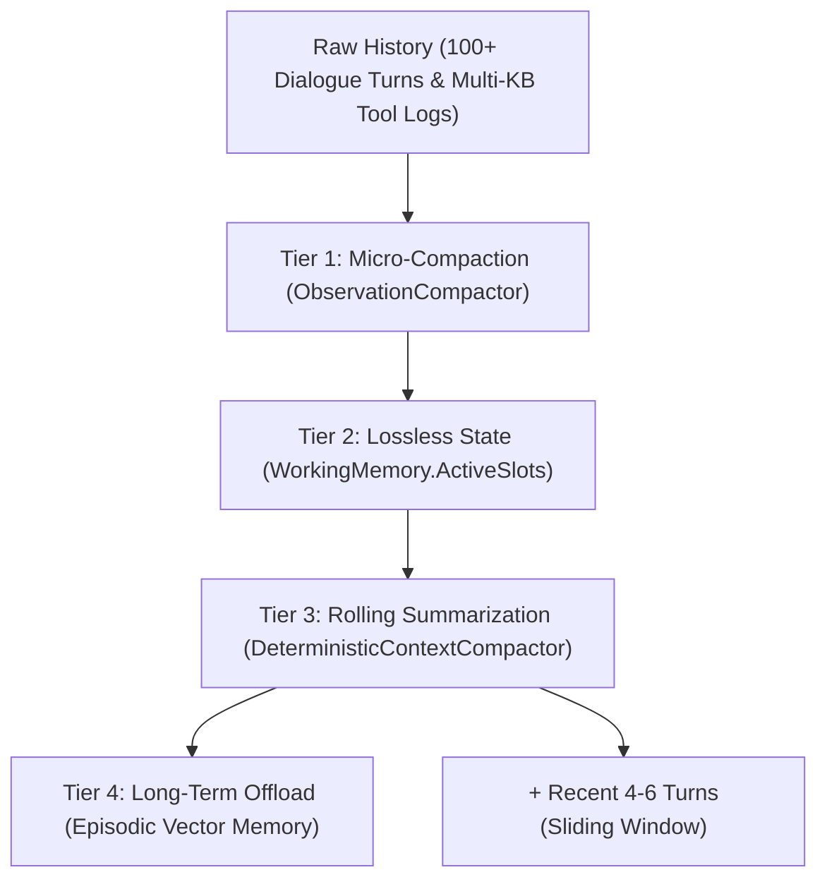

# 🤖 ZeroAgent: Sovereign Pure C# Cognitive Agent & Multi-Agent Swarm Framework

[](LICENSE)
[](https://dotnet.microsoft.com/)
[-brightgreen.svg)]()
[]()
[]()

**ZeroAgent** is an enterprise-grade, deterministic AI Agent and Multi-Agent Swarm framework engineered in **100% pure C#** for the .NET ecosystem. Operating in **Tier 5 (Presentation & Orchestration)** of the [ZeroPlatform](https://github.com/kzxl/ZeroPlatform) ecosystem, ZeroAgent provides autonomous ReAct execution loops, zero-reflection tool calling protocols, sub-5ms task-oriented dialogue tracking, 4-tier agentic memory, and CSP-based multi-agent coordination—completely independent of external heavy Python runtimes or cloud-locked SDKs.

---

## 🏛️ The 5 Pillars of ZeroAgent Architecture

ZeroAgent is engineered around 5 foundational architectural pillars designed for high throughput, sub-millisecond predictability, and verifiable safety:

```
                      ┌───────────────────────────────────────────────┐
                      │              ZeroAgent Core Engine            │
                      └──────────────────────┬────────────────────────┘
                                             │
             ┌───────────────────────────────┼───────────────────────────────┐
             │                               │                               │
             ▼                               ▼                               ▼
    ┌─────────────────┐             ┌─────────────────┐             ┌─────────────────┐
    │    Pillar 1:    │             │    Pillar 2:    │             │    Pillar 3:    │
    │ Zero-Reflection │             │ Two-Tier Bridge │             │ KV-Cache Layout │
    │  Tool Protocol  │             │ Reflex <-> ReAct│             │ Prefix Stability│
    └─────────────────┘             └─────────────────┘             └─────────────────┘
             │                               │
             ▼                               ▼
    ┌─────────────────┐             ┌─────────────────┐
    │    Pillar 4:    │             │    Pillar 5:    │
    │ Knapsack Budget │             │ Fluent Builder  │
    │ Context Packer  │             │ Type-Safe DSL   │
    └─────────────────┘             └─────────────────┘
```

### 1. Zero-Reflection Tool Protocol (`IAgentTool`)
- High-performance tool registration through strongly-typed delegates and explicit schema contracts (`JsonSchemaConstraint`).
- Zero reflection overhead during invocation, enabling sub-microsecond tool dispatch.
- Native Human-in-the-Loop (`HitlSafetyGate`) gating for destructive, safety-critical, or high-privilege actions with cryptographic audit logging.

### 2. Two-Tier Cognitive Escalation Bridge (`CognitiveEscalationBridge`)
- **Tier 1 (Reflex Fast Path)**: Pure C# CPU-based NLU and Dialogue State Tracking (DST). Handles slot filling, state machines, and routine operational inquiries in sub-5ms with **0 GPU / LLM cost**.
- **Tier 2 (Deliberative ReAct Engine)**: Activated automatically when analytical reasoning is demanded (*"tại sao"*, *"phân tích"*, *"đối chiếu"*) or when NLU confidence drops below threshold ($< 0.45$). Executes autonomous multi-step reasoning, tool observation cycles, and self-correction.

### 3. KV-Cache Friendly Prompt Layout (`PromptLayout`)
- Structurally partitions prompt templates into **Static Prefix** (System Role, Safety Directives, Tool Schemas) and **Dynamic Suffix** (Working Memory, Slots, Contextual turns).
- Guarantees maximum prefix KV-cache reuse on local inference engines (`ZeroInference` / vLLM / llama.cpp), cutting TTFT (Time-To-First-Token) by up to 70%.

### 4. Knapsack Context Budget & Compaction Engine (`ContextBudgetManager` & `IContextCompactor`)
- Algorithmic token budgeting applying greedy/knapsack optimization to pack message histories, dynamic tool schemas, and episodic recollections into strict context windows.
- Lossless context distillation via `DeterministicContextCompactor`: transforms evicted historical turns into high-density `<CONTEXT_SUMMARY>` blocks, completely preventing context degradation ("Lost in the Middle") and escalation blindness.
- Observation masking via `ObservationCompactor`: compresses multi-kilobyte tool outputs down to compact semantic signatures inside ReAct execution trajectories.

### 5. Fluent Builder DSL (`ZeroAgentBuilder`)
- Unified, type-safe builder interface to declaratively compose Memory Engines, Cognitive Escalation Bridges, Safety Gates, Tools, and Model Backends.

---

## 🧠 4-Tier Agentic Memory System

ZeroAgent features a multi-tiered cognitive memory hierarchy that mimics human operational cognition:

```
┌────────────────────────────────────────────────────────────────────────┐
│                        4-Tier Agentic Memory                           │
├───────────────────┬────────────────────────────────────────────────────┤
│ Tier              │ Description & Scope                                │
├───────────────────┼────────────────────────────────────────────────────┤
│ Working Memory    │ Active conversation turns, slot tracking, and      │
│                   │ deterministic Anaphora / Coreference Resolution    │
│                   │ (resolves "nó", "máy này" -> active equipment ID). │
├───────────────────┼────────────────────────────────────────────────────┤
│ Semantic Memory   │ SOPs, operational manuals, and domain guidelines   │
│                   │ vector-indexed via ZeroVector for instant recall.  │
├───────────────────┼────────────────────────────────────────────────────┤
│ Episodic Memory   │ Historical incidents, past failures, and verified  │
│                   │ resolutions stored as semantic episodes.           │
├───────────────────┼────────────────────────────────────────────────────┤
│ Response Cache    │ High-confidence (similarity >= 0.95) vector cache  │
│                   │ for idempotent queries, bypassing NLU/LLM cycles.  │
└───────────────────┴────────────────────────────────────────────────────┘
```

---

## 🗜️ 4-Tier Context Compaction & Rolling Summarization

To support multi-turn sessions (50–100+ turns) without context rotting, token overflow, or latency spikes, ZeroAgent incorporates a 4-tier context compaction hierarchy:



1. **Tier 1: Observation Masking (`ObservationCompactor`)**:
   - Truncates voluminous tool outputs (such as TSDB queries or SQL dumps) into compact head/tail signatures while retaining essential metrics, reducing trajectory token consumption by 70–85%.
2. **Tier 2: Structured Working Memory Retention**:
   - Critical entities (`machine_id`, `metric`, `area`, `tableName`) are tracked in typed slot dictionaries outside of the message array and are never lost during text truncation.
3. **Tier 3: Pure C# Rolling Summarization (`DeterministicContextCompactor`)**:
   - Executes in **< 0.05 ms** without requiring external LLM calls.
   - When turns exceed `MaxRetainedTurns` or when `PruneToTokenBudget` is triggered, older turns are distilled into a high-density `<CONTEXT_SUMMARY>` block preserving verified decisions and chronological milestones.
   - Injected into `CognitiveEscalationBridge` so that deliberative ReAct agents have 100% historical context awareness.
4. **Tier 4: Episodic Vector Offloading**:
   - Deep diagnostic episodes and solutions are permanently indexed in `AgenticMemoryEngine.EpisodicMemory` for on-demand associative recall.

---

## 👤 Long-Term User Persona & Behavioral Personalization Memory (`UserPersona`)

Similar to ChatGPT's custom instructions and context memory, ZeroAgent tracks long-term user characteristics across sessions:

- **Linguistic Pronoun Detection**: Dynamically recognizes communication pronouns ("anh - em", "tao - mày", "tôi - bạn") from user utterances and automatically personalizes response salutations (`Dạ anh...`, `...nhé!`).
- **Domain & Topic Affinity**: Tracks interaction frequencies per intent (`DominantDomain`), enabling rapid disambiguation of ambiguous questions (e.g. defaulting to Sales Orders for Sales Managers without repetitive confirmation).
- **Transactional Safety (No Entity Guessing)**: Avoids arbitrarily pre-filling or assuming specific entities (customers, order codes); users must explicitly provide or confirm entity identifiers to guarantee enterprise transactional integrity.

---

## 🚪 Anonymous Guest Chat & In-Flight Session Upgrade (`UserRole.Guest`)

ZeroAgent natively supports unauthenticated public guest interactions alongside enterprise users:

- **Auto-Detection & Session Isolation**: Session IDs prefixed with `guest_` or `anon_` are automatically resolved to `UserRole.Guest`. Each guest operates with strictly isolated ephemeral memory, preventing cross-guest persona contamination.
- **Public Inquiries Without Login**: Guests can freely access public FAQs, company information, and SOP manuals indexed in `SemanticMemory`.
- **Role-Based Action Gates**: Protected operational intents (machine control, live PLC actuation, sensitive ERP financial/sales queries) are blocked by RBAC gates with a polite, non-punitive authentication prompt (`FormatGuestLoginRequired`).
- **In-Flight Session Upgrade (`UpgradeGuestSession`)**: When a guest logs in midway through a conversation, their collected slots, multi-turn history, and intent state are seamlessly migrated to the authenticated `UserProfile`, allowing immediate execution without re-asking questions.

---

## ⚖️ Memory vs Intent Dynamic Conflict Arbitration Matrix

To eliminate collisions between vector memory search (Semantic / Episodic) and transactional intents:

| Layer / Mechanism | Conflict / Duplication Mode | Dynamic Arbitration Resolution |
|---|---|---|
| **Working Memory Guard** | User answering a slot matches keywords in a document | During `SessionState.CollectingSlots`, slot accumulation strictly takes precedence over memory queries, preventing dialogue loops. |
| **Substring Intent Ambiguity** | Query contains "quá nhiệt" in "Quy trình xử lý quá nhiệt F-01" | Explicit inquiry modifiers (`quy trình`, `hướng dẫn`, `sự cố`, `lịch sử`) route directly to Knowledge / Episodic retrieval rather than misfiring live telemetry (`CHECK_TEMPERATURE`). |
| **Conversational Interruption** | User digresses with an SOP question while filling slots | Knowledge query is resolved immediately (`SessionState.Idle`), while preserving the pending slot in Working Memory for subsequent turns. |
| **High-Confidence Intent Supremacy** | Generic document keyword overlaps with dedicated intent | Specialized operational intents with high confidence ($\ge 0.65$) take precedence over loose keyword document matches. |

---

## 📄 Declarative JSON Intent & Database Binding Architecture

Enables zero-code ERP business expansion without modifying C# or restarting servers:

```json
{
  "IntentId": "ERP_QUERY_SALES_ORDER",
  "DisplayName": "Tra cứu đơn hàng bán",
  "SampleUtterances": ["kiểm tra đơn hàng", "tình trạng đơn sale"],
  "Slots": [{ "Name": "order_code", "Type": "string", "IsRequired": true }],
  "DataSource": {
    "Provider": "SqlServer",
    "ConnectionKey": "ERP_Production",
    "Query": "SELECT OrderCode, CustomerName, DeliveryStatus FROM tb_SalesOrders WHERE OrderCode = @order_code",
    "Parameters": { "@order_code": "{{slots.order_code}}" }
  },
  "ResponseTemplate": "Đơn hàng {{OrderCode}} của {{CustomerName}} - Trạng thái: {{DeliveryStatus}}"
}
```

- **Pluggable Executors (`IDataSourceExecutor`)**: Built-in support for `SqlServer`, `Postgres`, `Sqlite`, `DataFrame` (ZeroData in-memory), and `RestApi`.
- **Zero SQL Injection**: 100% parameterized query execution.

---

## 🛠️ Industrial Tool Suite & Partial Modularity

The framework is partitioned into modular, single-responsibility components and partial classes:

- **`DynamicDatabaseQueryTool`**:
  - `DynamicDatabaseQueryTool.cs`: Schema metadata catalog and unified query dispatch.
  - `DynamicDatabaseQueryTool.LiveSql.cs`: Direct live SQL Server pushdown with connection pooling and schema introspection.
  - `DynamicDatabaseQueryTool.DataFrame.cs`: In-memory tabular queries and vector search over `ZeroData.DataFrame`.
- **`TsdbQueryTool`**:
  - `TsdbQueryTool.cs`: Rolling telemetry metrics (avg, min, max, count, latest).
  - `TsdbQueryTool.Anomalies.cs`: Statistical Z-score outlier and anomaly detection.
  - `TsdbDataPoint.cs`: Dedicated time-series data model.
- **`DialogueStateTracker`**:
  - `DialogueStateTracker.cs`: Diacritic-tolerant intent recognition and neural classifier binding.
  - `DialogueStateTracker.Entities.cs`: Multi-slot extraction and FSM state transition engine.

---

## 📊 Stress & Concurrency Benchmarks

ZeroAgent has undergone rigorous stress testing under enterprise multi-tenant workloads:

```
================================================================================
CONCURRENT MULTI-CONTEXT STRESS BENCHMARK RESULTS
================================================================================
Concurrent Active Users:    100
Distinct Question Patterns: 20
Total Processed Turns:      300
Wall-Clock Execution Time:  103 ms
Throughput Rate:            ~2,912.62 turns/sec
Average Turn Latency:       0.34 ms
Test Suite Status:          86 / 86 Passed (100%)
================================================================================
```

### Highlights:
- **Zero Cross-Talk**: Complete context isolation across 100 simultaneous user sessions.
- **Sub-Millisecond Execution**: Core Reflex path executes in $< 1$ ms on standard multi-core CPUs.
- **Ultra-Fast Context Compaction**: 1,000 deterministic compaction iterations completed in $< 20$ ms ($< 0.02$ ms/op).
- **Long-Term User Persona**: Dynamically detects pronouns ("anh-em", "tao-mày", "tôi-bạn") and tracks topic/entity preferences across sessions like ChatGPT memory.
- **Deterministic Slot-Filling**: Diacritic-tolerant NLU reliably extracts parameters regardless of Vietnamese accent variations (e.g., *"ap suat"*, *"áp suất"*, *"ap-suat"*).

---

## 🚀 Quick Start

### 1. Fluent Agent Construction (`ZeroAgentBuilder`)

```csharp
using ZeroAgent.Core.Builder;
using ZeroAgent.Tools.Data;
using ZeroAgent.Tools.Storage;

var agent = ZeroAgentBuilder.Create()
    .WithName("FactorySupervisor")
    .WithRole("Chief Autonomous Plant Dispatcher")
    .WithMemory(dimension: 128)
    .WithTokenBudget(maxTokens: 4096)
    .WithTool(new AgentTool("read_sensor", "Reads telemetry", "sensorId: string", (arg) => Task.FromResult("75.2 C")))
    .WithHitlSafetyGate(timeoutSeconds: 30)
    .Build();
```

### 2. Sub-5ms Task Dialogue Engine (`ZeroDialogEngine`)

```csharp
using ZeroAgent.Dialog.Engine;
using ZeroAgent.Dialog.Memory;

var engine = new ZeroDialogEngine();

// First turn: Inquire about a piece of equipment
var res1 = await engine.ChatAsync("session_user_01", "Kiểm tra nhiệt độ máy nén C-102");
Console.WriteLine(res1.Text);
// Output: "Nhiệt độ của thiết bị C-102 hiện tại là 78.4°C (Bình thường)."

// Second turn: Coreference resolution ("nó" -> "C-102")
var res2 = await engine.ChatAsync("session_user_01", "Áp suất của nó thế nào?");
Console.WriteLine(res2.Text);
// Output: "Áp suất hiện tại của C-102 là 6.2 bar."
```

### 3. Deliberative ReAct Escalation

```csharp
// Asking for deep analytical reasoning escalates from Reflex to ReAct Deliberation
var res3 = await engine.ChatAsync("session_user_01", "Tại sao áp suất C-102 tăng đột biến?");
Console.WriteLine(res3.Text);
// [Escalated to Tier 2 ReAct Engine]
// Output includes structured Thought -> Action (TSDB Anomaly Scan) -> Observation -> Analytical Explanation.
```

---

## 📦 Solution Architecture

```
ZeroAgent/
├── src/
│   ├── ZeroAgent.Core/          # ReAct loops, context managers, Knapsack budgeting, tools protocol
│   ├── ZeroAgent.Dialog/        # ZeroDialogEngine, DST (FSM), 4-Tier Memory, Anaphora resolution
│   └── ZeroAgent.Tools/         # DynamicDatabaseQueryTool, TsdbQueryTool, HitlSafetyGate
└── tests/
    └── ZeroAgent.Tests/         # 58 comprehensive unit, integration, DST, and 100-user stress tests
```

---

## 🌐 Multi-Target Support

| Target Framework | Status | Runtime Notes |
| :--- | :---: | :--- |
| **.NET 8.0+** | ✅ Active | Hardware intrinsics, `Span<T>`, modern async pipeline |
| **.NET Standard 2.0** | ✅ Active | Cross-platform integration (.NET Core 2.0+, Unity, Mono) |
| **.NET Framework 4.6.2** | ✅ Active | Legacy industrial SCADA, WinForms, and WPF compatibility |

---

## 📄 License

Architected and developed by **Phong Võ** (`kzxl`) for the **ZeroUniverse / ZeroPlatform** ecosystem. Released under the **MIT License**.
